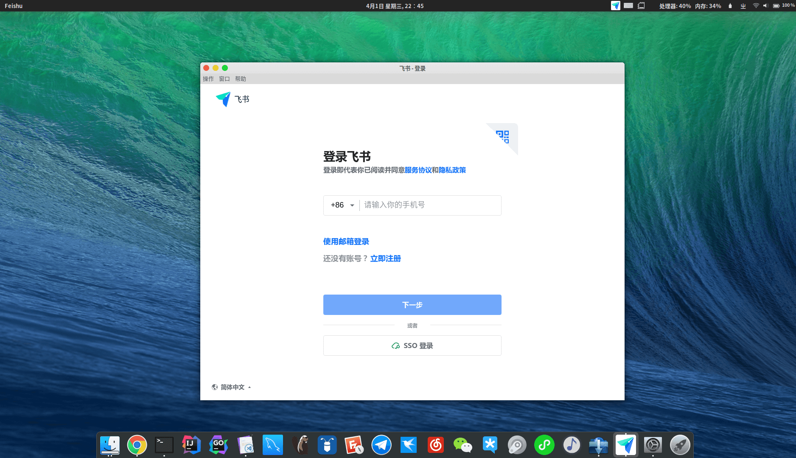
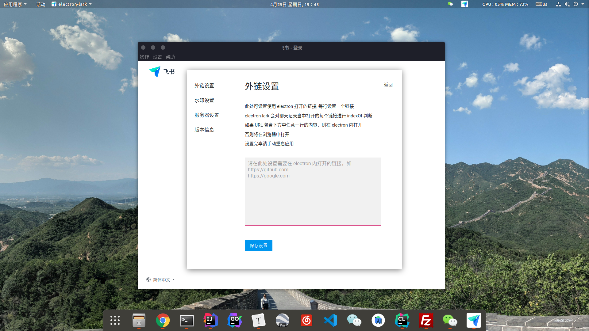

# Electron-Lark

 

 ***下载地址: [Release](https://github.com/Ericwyn/electron-lark/releases)***


electron 版的飞书 Feishu (原 Lark)，对网页版本进行封装

相比起普通网页版，功能如下

- 独立的运行窗口，不容易误关闭
- 关闭程序时后台运行，隐藏到通知栏小图标，双击可重新打开界面
- 新消息提醒，状态栏小图标闪烁
- 解除浏览器限制，避免因浏览器版本不对而提示无法使用

已知问题
 - 部分功能无法使用(工作台/会议等)
    - 飞书网页版缺陷，请向官方反馈

历史问题
 - ~~ubuntu18.04 Gnome 桌面，锁屏之后，系统通知栏图标 Tray 会消失, 当前规避方案如下~~
    - ~~当有新消息提醒的时候，会重置通知栏图标 tray，保证哪怕因为锁屏导致 tray 消失，在收到新消息之后也会重新出现并闪烁~~
    - 使用 alt + shift + m 的快捷键，重新显示界面以及 dock 图标
    - ~~V1.0.3 版本已修复，添加了一个 linux 锁屏监听，自动 reset appTray~~
        - V1.1.1 版本升级了 electron 依赖，问题解决~


(另外有一说一, 飞书的技术架构就是基于 Electron 的, Windows 和 Mac 客户端也都是使用 Electron 打包, 既然如此为什么不顺便为 Linux 也提供支持呢 ?)

 - 2021-04-26更新：后知后觉 deepin 商店已经有 wine 版本的飞书了，详情可看这个 [deepin官方帖子](https://bbs.deepin.org/post/208466)
    
   如果公司使用的并不是自己部署版本的飞书的话，可以尝试一下，ubuntu 上面可以再加一个 [deepin-wine-ubuntu](https://github.com/wszqkzqk/deepin-wine-ubuntu/issues/269) 

 - 2021-10-11更新：飞书在大概 9 月份时候就已发布了 Linux 客户端(当前还是 Beta)，大家可以下载一下官方的看看 ~ 
   
   但如果公司使用的是自己部署版本的飞书的话~ 现在看来好像还是只能用网页版套壳 🤷‍♂️
 

## 运行截图



## 版本记录

### V1.1.5
 - electron 版本升级为 15.0.0
 - 修复某些时候设置页面无法关闭的问题

### V1.1.4
 - 程序菜单修改，新增 “操作->浏览器打开”，可在浏览器打开当前窗口页面

### V1.1.3
 - 修复通知消息点击后跳转聊天窗口失败的问题

### V1.1.2
 - electron 版本升级为 13.0.1
 - 点击消息通知打开应用时候会跳转到具体的聊天窗口, 感谢 [ttys3 的分享](https://github.com/Ericwyn/electron-lark/commit/f8c4781fab5c6cd704aa2bba4be0d4d0cedcaab1#commitcomment-51571446)

### V1.1.1
抄了 [ttys3](https://github.com/ttys3) 大佬的作业，感谢大佬！
 - 禁用硬件加速来修复 CPU 占用过高的问题 [issue12](https://github.com/Ericwyn/electron-lark/issues/12)
 - 升级 electron 到 13.0.0-bate 解决 appTray 消失问题，不再使用 dbus-monitor 方案
 - 支持点击通知打开应用，使用拦截网页消息通知并使用 electron 来重新发送的方式实现

### v1.1.0
 - 咕咕咕了很久的设置界面终于加上了 (~~又不是不能用~~)
 
    在顶部菜单栏: 设置 -> 功能设置处进入，当前支持自定义以下设置项
    
    - 外链设置
        - 可设置哪些链接直接 electron 内部打开
        - 默认所有链接都通过浏览器打开
    - 水印设置
        - 是否显示页面水印
        - 默认为关闭
    - 服务器设置
        - 如果公司使用的是内部部署飞书服务，可由此自定义登录入口
        - 默认为飞书官方登录页面
  - electron 依赖升级到 12.0.5
  
  -  
  
### v1.0.3
 - 修复 ubuntu 下锁屏后 appTray 消失的问题

### v1.0.2
 - 修复已关闭提醒的聊天仍然会闪烁 tray icon 的问题

### v1.0.1
 - 去除页面水印
 - 修改了应用菜单,去除无用按钮

### v1.0.0
 - 初始版本


## 安装方法 (二进制安装)
 - 请从 [Release](https://github.com/Ericwyn/electron-lark/releases) 页面直接下载及安装 （ubuntu 18.04 上测试通过）

## 安装方法 (从源码安装)

### 0. 安装 NodeJs
请先按照官网教程安装 NodeJs，确保以下命令可以成功运行

    node -v
    npm -v


### 1. 安装 Electron

参考 https://qii404.me/2019/07/10/electron.html

```
# 墙内的话安装过程中会下载失败，需要首先设置electron的源为淘宝源即可
npm config set ELECTRON_MIRROR http://npm.taobao.org/mirrors/electron/

# 全局安装 需要的话追加上 --registry='http://registry.npm.taobao.org' 使用淘宝npm源安装
sudo npm install electron -g --allow-root -unsafe-perm=true
# Windows使用下面语句 64位32位机器都是--win32
npm install electron -g --platform=win32

# 验证安装
electron -v
```


### 2.运行

工程目录下使用下面命令运行

```
electron .
```
